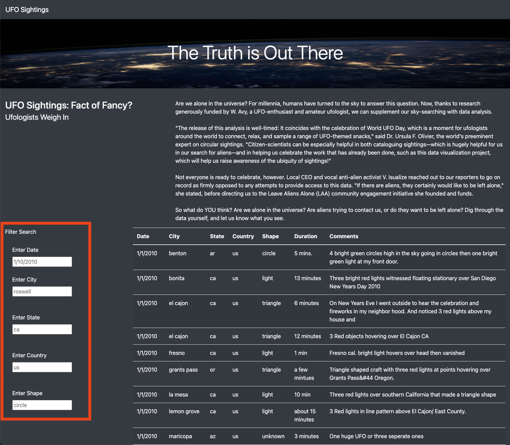
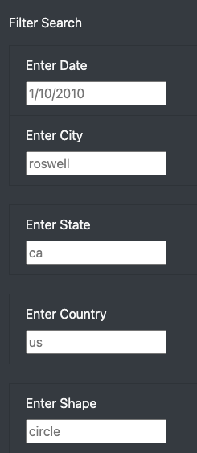
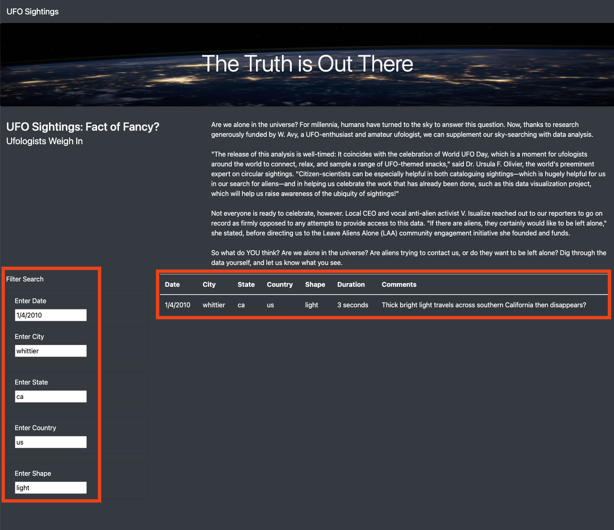

# UFOs
## Overview of the Analysis
The purpose of this analysis project was to provide an in-depth analysis of UFO sightings by creating a HTML webpage with an UFO article and a dynamic table for visualization.  The dynamic table contains UFO sightings data which was stored in a JavaScript array.  I created multiple filters to make the table fully dynamic for the user, meaning that the table will react to the users input for not only one applied filter but up to five different filters at one time.  Lastly, I customized the webpage using Bootstrap to give it a dark, space, ambiance and a “jumbotron” image of Earth at night.

## Results
With the dynamic table available for the user to reference UFO sightings, it’s simple for the user to use the multiple filters (left of table) to refine their search and find exactly which record(s) the user is interested in. 

### Navigate to Filter Search
First, the user will need to navigate to the Filter Search section of the webpage, in most cases this in located in the bottom left section of the page (red outlined).  The webpage is fully dynamic as well, so the Filter Search section’s exact position on the webpage could vary depending on the size of monitor being used or mobile device.  

 

### Apply Filter Arguments
Next the user can enter as many or as few arguments into the applicable filter field.  The filters currently available for the user to use are Date, City, State, Country and Shape.  An example of the input field’s format is also displayed in grey inside the filter field box for the user to reference for the required format. 

 

### View Filtered Table
After the value is entered into the filter box the user can slimily press “Enter” and the dynamic table will respond with the filter(s) applied.

## Summary
### Website Drawback
The UFO sightings webpage looks clean and allows the user to filter through the different UFO sightings using the search bars.  A major drawback of this webpage is that each UFO record in this data isn’t validated which is the purpose of this website.  It would be helpful if we had a number of people who witnessed the sighting as a data field, this would be a helpful element to validating the claims.  I believe having as much data as possible for the user to analyze would make the website even more creditable to the user.

### Website Improvements
After using and testing the website I thought of three improvement recommendations that would make the user experience for this website even better.   First, I believe that keeping this UFO information as up-to-date as possible would allow to user experience for the website to be enjoyed years after it was created.  UFO sightings will continue to occur so creating an “Update” button to update the UFO sightings data, which was stored in a JavaScript array, would be a great feature.  Second, stated above, it would be helpful if we had a number of people who witnessed the sightings as a data field, this would be a helpful element to validating the claims.  Lastly, by creating another filter option of “Duration” would allow the user to have even more options in filtering the dynamic table to exactly which record(s) they are searching for.
